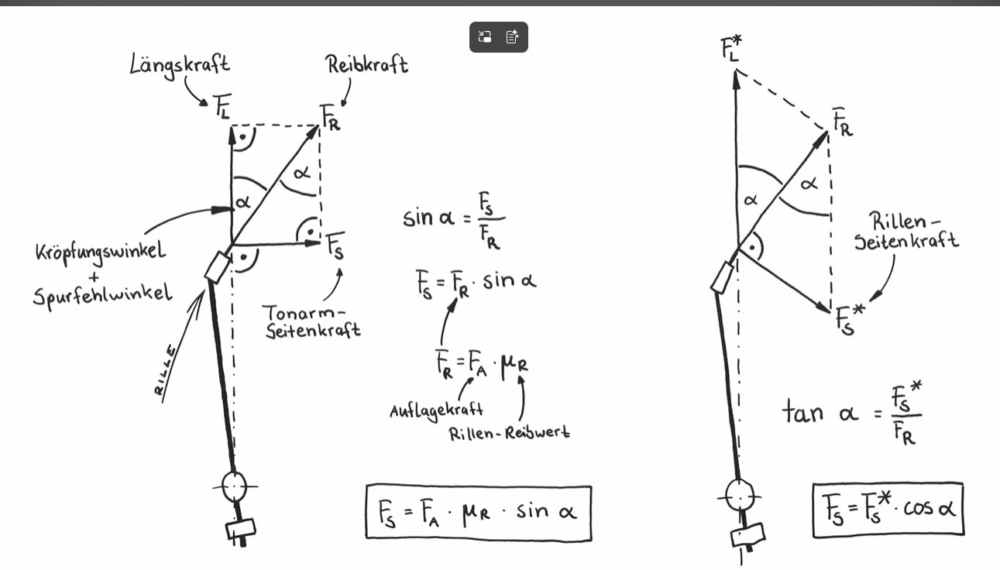

# Bauer (1945) Tonearm Tracking Angle — User Guide

**Based on:** B. B. Bauer, *"Tracking Angle in Phonograph Pickups"*, Electronics, March 1945

---

## What this app does

This app calculates and visualises the **tracking angle**, **tracking error**, **skating force**, and **2nd harmonic distortion** of a pivoted tonearm across the record surface — using Bauer's exact geometric formula (Eq. 4), with no small-angle approximations.

Four tabs show the results as interactive plots. All plots update live when you change any value in the sidebar.

---

## Sidebar — step by step

### 1. Record groove radii

Select the inner and outer groove radius standard for the records you are analysing.

| Standard | Inner radius | Outer radius |
|---|---|---|
| **IEC 1958 / RIAA 1963** (default) | 60.325 mm | 146.05 mm |
| DIN | 57.5 mm | 146.0 mm |
| JIS 1981 | 57.6 mm | 146.6 mm |

Use **Custom** to enter any radius manually. These values set the left and right boundaries of all plots.

---

### 2. Specify arm geometry

Choose whether to enter the arm by:

- **Effective length l** — the straight-line distance from pivot to stylus tip (most tonearm specs use this)
- **Pivot-to-spindle distance d** — the distance from the tonearm pivot to the record spindle

The two are related by: **l = d + D** where D is the overhang. The app computes and displays the other value automatically based on the first overhang curve you have entered.

> **SME V example:** l = 233.15 mm, d = 215.36 mm, D = 17.79 mm

---

### 3. Overhang curves D (mm) and offset angle β (°)

This is where you define the **arm geometry curves** you want to plot. Each curve has two parameters:

- **D** — overhang in mm (positive = stylus extends beyond spindle centre; negative = underhung)
- **β** — head offset angle in degrees (the angle between the arm centreline and the cartridge body)

You can add up to **4 curves** using the **＋ Add curve** button. Each gets its own colour. These are the **solid lines** on all plots.

> ⚠️ **Important:** D and β are independent inputs. Entering a new arm length **does not automatically recalculate D and β** to an optimal alignment. If you change the arm length without updating D and β, the solid curves will show the tracking behaviour of that D/β combination on the new arm — which may not be optimal at all. To see the optimal alignment for any arm length, use the **Standard alignment checkboxes** described below.

---

### 4. Include underhung arm (Eq. 22)

Bauer's Equation 22 gives the **mathematically optimal overhang for a straight arm with no offset angle (β = 0)**. This is a negative overhang (underhung arm). Tick this checkbox to overlay it as a **dashed reference curve** on all plots.

The checkbox label shows D, β = 0°, and either the pivot-to-spindle distance or effective length, depending on what you selected above.

---

### 5. Standard alignment (optional)

These are the three classic alignment optimisation methods from the literature. Tick any combination to overlay them as **dash-dot reference curves** on all plots.

| Alignment | Optimisation criterion | Null radii (IEC) |
|---|---|---|
| **Löfgren A** (Baerwald) | Three equal distortion peaks at inner groove, valley, and outer groove | N1 = 66.0 mm, N2 = 120.9 mm |
| **Löfgren B** | Minimum RMS distortion, same linear offset as Löfgren A | N1 = 70.3 mm, N2 = 116.6 mm |
| **Stevenson** | Zero tracking error at inner groove | N1 = 60.3 mm, N2 = 117.4 mm |

When a standard alignment is ticked, a green info box shows:
- The two **null radii** N1 and N2 (where tracking error = 0)
- The resulting **overhang D** and **offset angle β**
- The **companion geometry value** (d or l, whichever you are not entering directly)

> 💡 **Key insight:** The null radii for standard alignments depend **only on the groove radii** (inner and outer), not on arm length. The D and β values that result from those null radii **do** depend on arm length. So if you change arm length, the standard alignment D and β values update automatically — the dashed curves always show the correct optimum for your arm.

---

### 6. Skating force

- **µ** — friction coefficient between stylus and groove. Typical values 0.25–0.35 for modern styli on vinyl.
- **Show skating force component:**
  - **Radial tan(φ)** — the force directed toward the spindle along the groove radius (Bauer's formulation)
  - **Tonearm arc sin(φ)** — the force component perpendicular to the arm, which actually drives the arm inward along its pivot arc
  - **Both** — plots both on the same chart: tan(φ) as thick lines, sin(φ) as thin lines, same colour per curve

#### The physics of skating force — two different formulations

The diagram below (from a German physics tutorial) shows why there are two different ways to express the skating force, and why they give slightly different results:

**Left diagram — Tonearm side force (Tonarm-Seitenkraft):**
The friction force F_R acts along the groove tangent at angle α (the combined offset + tracking error angle) to the arm axis. Decomposing F_R into components along and perpendicular to the arm gives the side force:

> **F_S = F_A · µ_R · sin(α)**

where F_A is the vertical tracking force (Auflagekraft) and µ_R is the groove friction coefficient (Rillen-Reibwert). This is the force that drives the arm inward along its pivot arc.

**Right diagram — Groove radial force (Rillen-Seitenkraft):**
Looking at the same geometry differently, the radial component of the friction force (pointing toward the spindle) is:

> **F_S\* = F_A · µ_R · tan(α)**

and the tonearm side force relates to this as F_S = F_S\* · cos(α).

**In this app**, the angle used is the tracking angle φ (not the tracking error α), following Bauer's treatment:
- **Radial force:** µ · tan(φ) × 100% of VTF
- **Tonearm arc force:** µ · sin(φ) × 100% of VTF

For typical overhung arms (φ ≈ 20–25°) the difference between tan and sin is about 8–10%. For underhung arms the tracking angle φ is small, so tan and sin are nearly identical — this is physically correct.

📺 **Excellent video explanation (German, with clear visuals):**
[Das verflixte Anti-Skating am Plattenspieler! — messen, berechnen, bauen, einstellen](https://www.youtube.com/watch?v=_Wo7G8mxcXQ&t=60s)

---

### 7. Distortion (Tab 4)

- **ωA (mm/s)** — peak modulation velocity of the recorded signal. This equals 2π × frequency × amplitude, and is the standard way recording engineers specify groove modulation level. Typical loud LP passages: 50–100 mm/s peak.
- **Record speed** — 33⅓, 45, or 78 rpm.

The distortion formula (Bauer Eq. 16) is:

**HD2 = (ωA × |φ − β|) / (ωr × r) × 100 %**

where ωr × r is the linear groove velocity (mm/s) at radius r. Distortion is zero at the null radii and highest at inner and outer groove extremes.

---

## The four plot tabs

### Tab 1 — Tracking Angle φ

Shows the absolute tracking angle φ (degrees) vs groove radius. The left panel shows the geometry diagram (pivot, stylus, groove tangent, and offset angle). The right panel shows φ curves for each arm configuration.

For a perfectly tangential arm φ would equal β everywhere — that is physically impossible for a pivoted arm.

### Tab 2 — Tracking Error α

Shows **α = φ − β** (degrees) vs groove radius. This is the tracking error — how far the stylus deviates from tangency at each groove radius.

- Where α = 0: the stylus is perfectly tangent to the groove. These are the **null radii**.
- Standard alignments place the null radii to minimise distortion across the playing surface.
- The Y-axis auto-scales. Use the min/max controls to zoom in.

### Tab 3 — Skating Force

Shows the skating force as a percentage of vertical tracking force (VTF). The force is proportional to the tracking angle φ and to the friction coefficient µ.

### Tab 4 — Distortion HD2

Shows the predicted 2nd harmonic distortion percentage vs groove radius. Distortion is zero at the null radii and peaks at the groove extremes.

---

## Understanding solid vs dashed lines

| Line style | Meaning |
|---|---|
| **Solid** | Your own D/β values from the overhang curve inputs |
| **Dashed** | Bauer Eq. 22 optimal underhung arm |
| **Dash-dot** | Standard alignment (Löfgren A, B, or Stevenson) |

> ⚠️ **The most common misunderstanding:** When you change the arm length, the **solid curves** do not automatically update to an optimal alignment. They continue to show whatever D and β values are in the input boxes — which may produce poor tracking if they were set for a different arm length.
>
> **The correct workflow for exploring different arm lengths:**
> 1. Enter the arm length (l or d)
> 2. Tick one or more **Standard alignment** checkboxes
> 3. Read the optimal D and β from the green info box
> 4. If you want, enter those values into the overhang curve inputs to compare against the standard
>
> The dashed/dash-dot reference curves always show the correct optimum for whatever arm length and groove radii are currently set.

---

## References

- Bauer, B.B. (1945). *Tracking Angle in Phonograph Pickups*. Electronics, March 1945, pp. 110–115.
- Löfgren, E. (1938). *Über die bei der Abtastung von Schallplatten auftretenden Verzerrungen infolge Winkelabweichungen des Abtaststiftes*. Akustische Zeitschrift, Vol. 3, pp. 350–362.
- Baerwald, H.G. (1941). *Analytic Treatment of Tracking Error and Notes on Optimal Pick-Up Design*. Journal of the Society of Motion Picture Engineers, Vol. 37, pp. 591–622.
- Stevenson, J.K. (1966). *Pickup Arm Design*. Wireless World, May–June 1966.
- Dennes, G. *A Comparison of Six Alignment Methods*. (Various editions, widely cited in the audio community.)

---

*Copyright Erik 2026. Licensed under the PolyForm Noncommercial License 1.0.0.*
